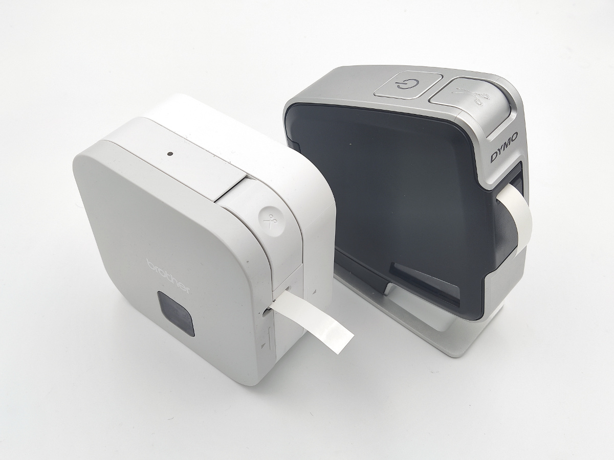

lbprint <!-- omit in toc -->
=======

[](https://www.npmjs.org/package/lbprint)

> Label printing CLI tool for linux. Supported printers:
>
> - DYMO LabelManager PnP.
> - Brother PT-P300BT.




- [Install dependencies](#install-dependencies)
  - [OS Packages (Ubuntu)](#os-packages-ubuntu)
  - [USB printer](#usb-printer)
  - [Bluetooth printer](#bluetooth-printer)
- [Install package](#install-package)
- [Use](#use)
- [Examples](#examples)


## Install dependencies

### OS Packages (Ubuntu)

Viewer & `node_canvas` build dependencies:

```sh
sudo apt-get install imagemagick build-essential libcairo2-dev libpango1.0-dev libjpeg-dev libgif-dev librsvg2-dev
```


### USB printer

Setup `udev` and `modeswitch` rules:

```sh
# For DYMO LabelManager PnP
curl -fsSL https://raw.githubusercontent.com/puzrin/lbprint/master/support/91-dymo-labelmanager-pnp.rules | sudo tee /etc/udev/rules.d/91-dymo-labelmanager-pnp.rules
curl -fsSL https://raw.githubusercontent.com/puzrin/lbprint/master/support/dymo-labelmanager-pnp.conf | sudo tee /etc/usb_modeswitch.d/dymo-labelmanager-pnp.conf

sudo systemctl restart udev.service
```


### Bluetooth printer

```sh
sudo usermod -a -G dialout $USER
# !!! re-login to update group pemissions.
```

Connect to printer (should be done every time before printer use):

```sh
# Get MAC address of PT-P300BT**** (remember it)
hcitool scan
# Connect to printer
sudo rfcomm connect 0 <MAC_ADDRESS> 1 &
```

Known issue: PT-P300BT falls into error state several seconds after print. Push
back button prior to next lbpint run.


## Install package

node.js v14+ required (for linux setup via [nvm](https://github.com/nvm-sh/nvm)).

```sh
# global install
npm i lbprint -g

lbprint -h
```

or

```sh
# local install from repo
git clone https://github.com/puzrin/lbprint.git
cd lbprint
npm install

./lbprint.js -h
```


## Use

```
usage: lbprint.js [-h] [-v] [-s <px>] [-g <line-gap>] [-m <px>]
                  [-p {dymo_lm_pnp,view}] [-t <mm>] [-f <name>] [--list-fonts]
                  [--scan] [--viewer <program>]
                  [text ...]

positional arguments:
  text                  text to print, each parameter gives a new line

optional arguments:
  -h, --help            show this help message and exit
  -v, --version         show program's version number and exit
  -s <px>, --font-size <px>
                        font size (pixels, use max possible if not set)
  -g <line-gap>, --line-gap <line-gap>
                        space between lines (pixels or "rem", 0.1rem by
                        default)
  -m <px>, --margin <px>
                        text horizontal margin (pixels, 30 by default)
  -p {dymo_lm_pnp,brother_ptp300bt,view}, --printer {dymo_lm_pnp,view}
                        printer to use (auto-detect by default)
  -t <mm>, --type-width <mm>
                        label type width (12 by default)
  -f <name>, --font <name>
                        font to use (file name for embedded, or full path for
                        the rest)
  --list-fonts          list available embedded fonts
  --scan                search & show available printers
  --viewer <program>    program to use for image view ('display' by default)
```

Note:

- By default `Roboto Regular` (scaleable) font is used. Use `--list-fonts` to
see all embedded alternatives.
- For small sizes you may wish o use `helvR<08|10|12|14>.bdf` font.

Any external BDF/TTF/WOFF fonts are allowed too, if full path provided.


## Examples

Print 2 lines of max possible size with default font:

```sh
lbprint 'foo bar' baz
```

Print 3 lines with fixed size Helvetica font, and minimal line gap.

```sh
lbprint -f helvR12.bdf -g0 foo bar baz
```
